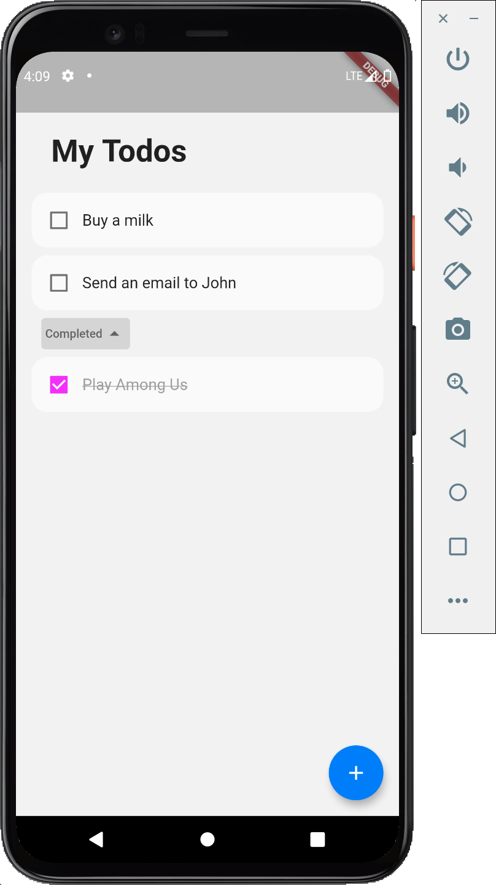

# flutter_todo

An example todo application with Flutter.

## Getting Started

Set up your Firebase project ([See the doc](https://firebase.flutter.dev/docs/overview)) and 
run the local emulator before running the app.

For how to run the Firebase local emulator, please [see the doc](https://firebase.google.com/docs/emulator-suite).
(Note that currently Firebase Auth emulator is expected to run on port `9099` and Cloud Firestore on `8080`.)

This example app does not have sign up feature yet, so please create an user on emulator UI first
to test the app. 

